# Task 1 : Cloud-Storage-Setup

AWS S3 Cloud Storage Setup Internship Task. This project demonstrates the creation, configuration, and secure management of a cloud storage bucket using Amazon S3 on AWS Free Tier.

---

## Step 1: Create an S3 Bucket

1. Login to AWS Console
2. Navigate to Amazon S3
3. Click Create bucket
4. Configure:

   * Bucket Name: **test-storage-komal**
   * Region: **ap-south-1 (Mumbai)**
   * Block Public Access: ✅ Enabled
5. Click Create bucket

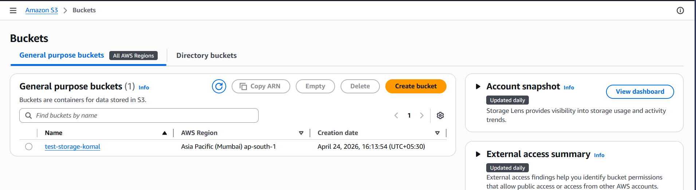

---

## Step 2: Create Folder Structure

Inside the bucket, create the following folders:

* test-documents/
* test-images/
* test-log/

This ensures organized storage.

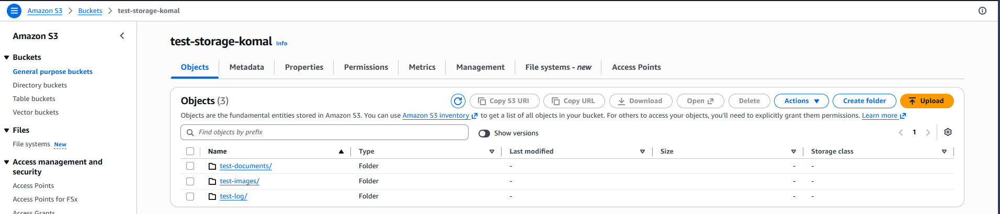

---

## Step 3: Upload Example Files

Uploaded files:

* test-documents → **test.txt**
* test-images → **test.jpeg**
* test-log → **battery-report.html**

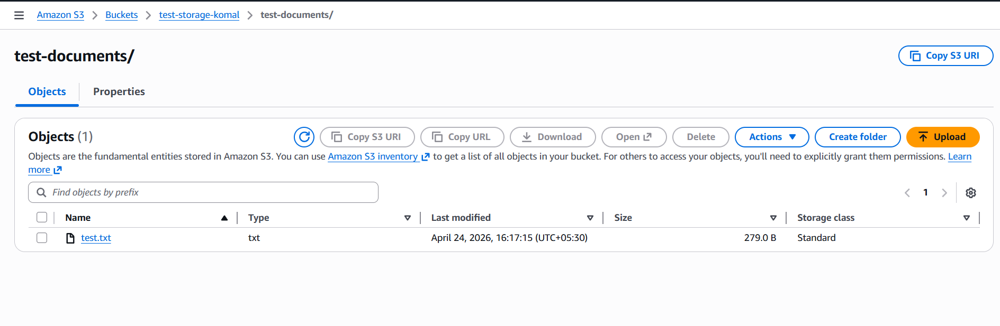
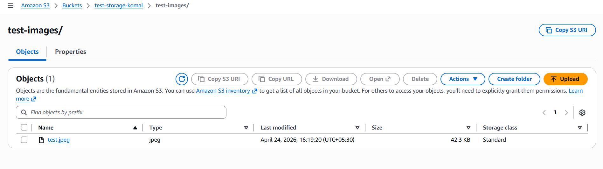
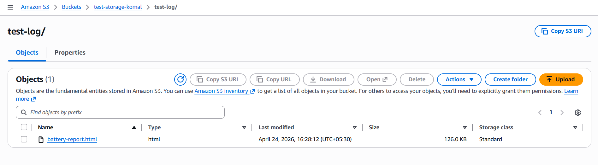

---

## Step 4: Configure Access Permissions

* Block Public Access: ✅ Enabled
* Object Ownership: Bucket owner enforced
* Access controlled using bucket policies & IAM

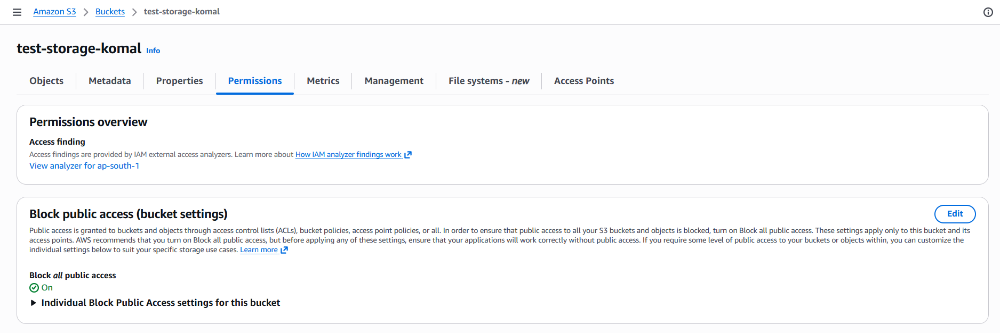

---

## Step 5: Enable Default Encryption

* Enabled Server-Side Encryption (SSE-S3)
* Ensures data is encrypted at rest

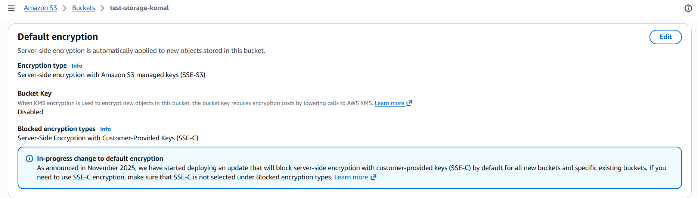

---

## Step 6: Enable Bucket Versioning

* Versioning: ✅ Enabled
* Helps recover deleted/overwritten files

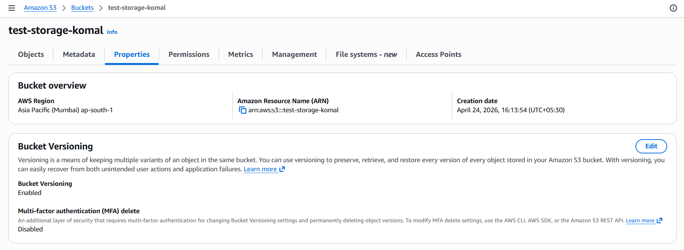

---

## Step 7: Verify Private Access

1. Copied Object URL
2. Opened in Incognito
3. Result: Access Denied

### test-documents

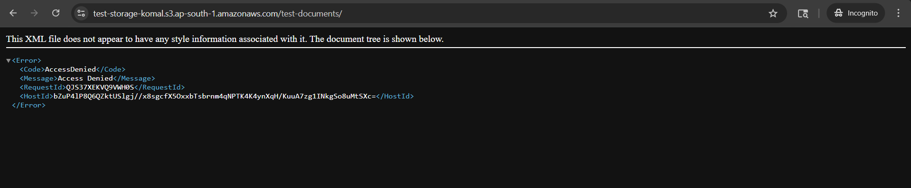

### test-images

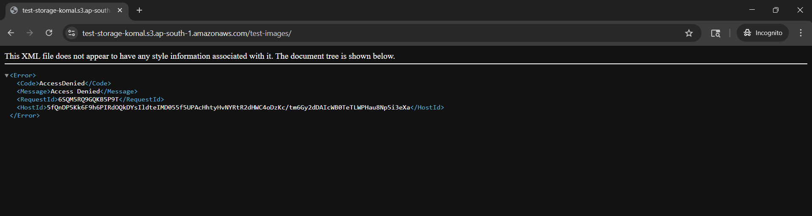

### test-log

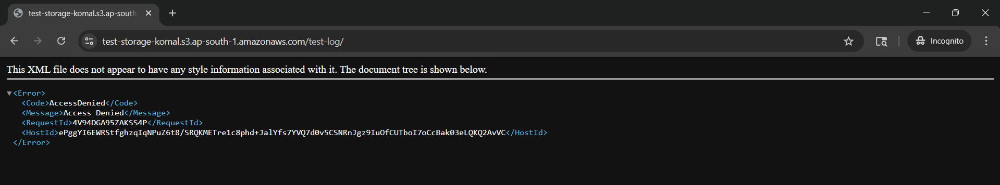

---

## Conclusion

An Amazon S3 bucket was successfully created and configured with secure access controls. Files were uploaded, encryption and versioning were enabled, and access restrictions were verified through AccessDenied responses.

This demonstrates a secure and scalable cloud storage implementation using AWS.
